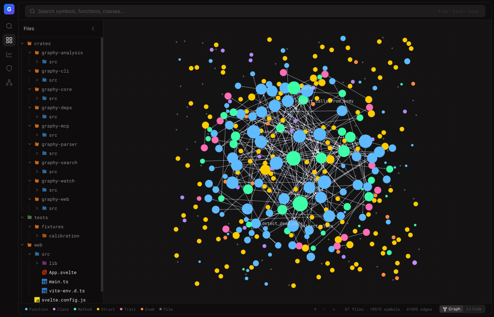
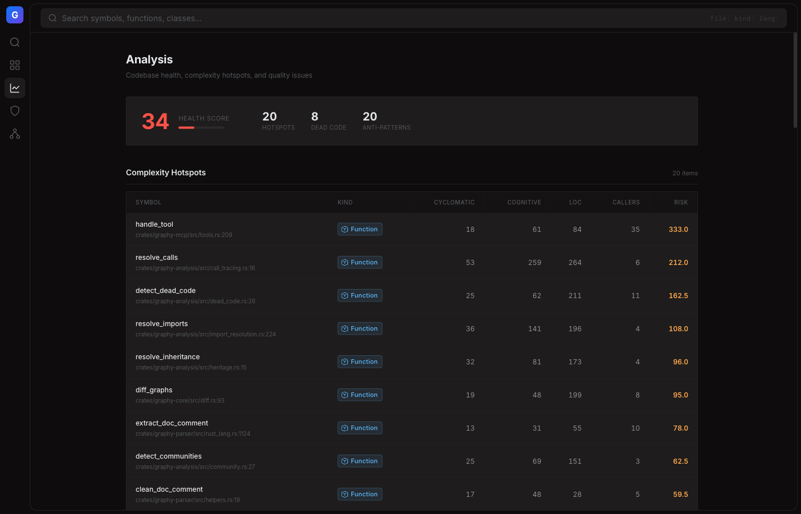

<p align="center">
  
</p>

<h1 align="center">Graphy</h1>

<p align="center">
  <strong>A code intelligence engine for your agents.</strong>
</p>

<p align="center">
  <a href="#install">Install</a> ·
  <a href="#quick-start">Quick Start</a> ·
  <a href="#using-with-claude-code">Claude Code</a> ·
  <a href="#web-dashboard">Dashboard</a> ·
  <a href="#cli-reference">CLI</a> ·
  <a href="#language-support">Languages</a>
</p>

---

Graphy is a code intelligence engine that parses your codebase into a rich knowledge graph and exposes it through a CLI, a web dashboard, and an MCP server for AI agents. It goes beyond what an LSP provides — understanding architecture, security risks, dead code, data flow, and blast radius across your entire project.

**One command. Every insight.**

```
$ graphy

  GRAPHY v1.0.0  ready in 1282ms

  >  Local:   http://localhost:3000/
  >  Graph:   10519 symbols · 41095 edges · 87 files
  >  Watch:   watching for file changes
```

## Why Graphy?

- **15-phase analysis pipeline** — from AST parsing to dead code detection, taint analysis, and change coupling
- **MCP server for AI agents** — give Claude (or any MCP client) deep codebase understanding with 3 tools and 14 capabilities
- **Web dashboard** — interactive graph visualization, complexity hotspots, security analysis, and architecture overview
- **13 languages** — Python, TypeScript, JavaScript, Rust, Svelte built-in; Go, Java, PHP, C, C++, C#, Ruby, Kotlin installable on demand
- **Live watch mode** — file watcher with incremental re-indexing; the graph is always up to date
- **15 framework plugins** — TOML-driven detection for Express, Django, Rails, Spring Boot, React, Next.js, Laravel, and more
- **Fast** — indexes 10,000+ symbols in ~1 second, 18MB binary, ~50MB RAM

---

## Install

### From crates.io

```bash
# CLI only — 18MB, recommended for AI agents / MCP
cargo install graphy --no-default-features

# Full — 29MB, includes web dashboard
cargo install graphy
```

### From source

```bash
git clone https://github.com/rosshhun/graphy.git
cd graphy

# CLI only
cargo install --path crates/graphy-cli --no-default-features

# Full (with web dashboard — requires Node.js 18+)
cd web && npm install && npm run build && cd ..
cargo install --path crates/graphy-cli
```

### Requirements

- Rust 1.75+ (for building from source)
- Node.js 18+ (only for the web dashboard)
- C compiler (only for `graphy lang add`)

---

## Quick Start

```bash
cd your-project

# Index and explore
graphy analyze        # Build the knowledge graph
graphy search "auth"  # Search for symbols
graphy impact login   # See blast radius of a function
graphy dead-code      # Find unused code
graphy hotspots       # Find risky complex code
graphy taint          # Run taint analysis (security)
graphy deps --vulns   # Check dependencies for CVEs

# Interactive
graphy                # Analyze + dashboard + watch (requires web feature)
graphy dev            # Same as above
```

---

## Using with Claude Code

Graphy is an [MCP server](https://modelcontextprotocol.io). Connect it to Claude Code so Claude can query your codebase's structure, security, and architecture in real-time.

### Setup

**Option 1 — Auto-configure** (recommended):

```bash
cd your-project
graphy init      # Creates .mcp.json, adds .graphy/ to .gitignore
```

**Option 2 — Manual `.mcp.json`**:

```json
{
  "mcpServers": {
    "graphy": {
      "command": "graphy",
      "args": ["serve", "--watch", "."]
    }
  }
}
```

**Option 3 — Global** (available in all projects):

```bash
claude mcp add graphy -- graphy serve --watch /path/to/project
```

### What Claude Gets

3 tools with 14 capabilities, plus 3 resources:

| Tool | Mode | What it does |
|------|------|-------------|
| `graphy_query` | `search` | Hybrid BM25 + fuzzy search across all symbols |
| | `context` | 360° view: callers, callees, types, with source snippets |
| | `explain` | Deep dive: full source, complexity, liveness score |
| | `file` | All symbols in a file and their external connections |
| `graphy_analyze` | `dead_code` | Unused code with probability scores (0–100%) |
| | `hotspots` | Riskiest code ranked by complexity × coupling |
| | `architecture` | Module overview, language breakdown, entry points |
| | `patterns` | Anti-patterns: god classes, high complexity, long params |
| | `api_surface` | Public vs internal API classification |
| | `deps` | Dependency tree with optional CVE vulnerability check |
| `graphy_trace` | `impact` | Blast radius with source at each call site |
| | `taint` | Security: data flow from sources to sinks |
| | `dataflow` | Data transformation chains through functions |
| | `tests` | Find tests that exercise a given symbol |

| Resource | URI | Description |
|----------|-----|-------------|
| Architecture | `graphy://architecture` | File count, languages, largest modules, entry points |
| Security | `graphy://security` | Taint paths, public API exposure |
| Health | `graphy://health` | Dead code %, complexity hotspots, graph confidence |

**Batch queries** — look up multiple symbols in one call:

```json
{ "name": "graphy_query", "arguments": { "mode": "context", "queries": ["authenticate", "authorize", "login"] } }
```

**Live updates** — with `--watch`, the server sends `notifications/resources/updated` when files change, so Claude always works with the latest graph.

---

## Web Dashboard

The dashboard visualizes your codebase as an interactive knowledge graph. Requires the `web` feature (included by default).

```bash
graphy dev ./my-project           # Analyze + dashboard + watch
graphy open ./my-project          # Dashboard only (skip re-analysis)
```

### Views

| View | What it shows |
|------|--------------|
| **Explorer** | File tree, force-directed graph (Sigma.js), symbol detail panel with callers/callees |
| **Search** | Full-text search with `file:`, `kind:`, `lang:` filters (Cmd+K shortcut) |
| **Analysis** | Health score, complexity hotspots table, dead code list, anti-pattern detection |
| **Security** | Taint analysis paths, public API exposure, vulnerability results |
| **Architecture** | Language/node/edge distribution, largest files, graph statistics |

<p align="center">
  
</p>

---

## CLI Reference

All commands default to the current directory.

### Everyday

| Command | Description |
|---------|-------------|
| `graphy` | Analyze + dashboard + watch (default) |
| `graphy dev [PATH]` | Same as above, explicit |
| `graphy init` | Create `.mcp.json` for Claude Code |
| `graphy open [PATH]` | Open dashboard only (skip re-analysis) |

### Analysis

| Command | Description |
|---------|-------------|
| `graphy analyze [PATH] [--full] [--lsp]` | Index a repository |
| `graphy search QUERY [-n N] [-k KIND]` | Search across all symbols |
| `graphy context SYMBOL` | Full symbol context (callers, callees, types) |
| `graphy impact SYMBOL [-d DEPTH]` | Blast radius analysis |
| `graphy dead-code [PATH]` | Dead code report with liveness scores |
| `graphy hotspots [-n N]` | Complexity × coupling risk ranking |
| `graphy taint [SYMBOL]` | Taint analysis results |
| `graphy deps [PATH] [--vulns]` | Dependencies + vulnerability scan |
| `graphy stats [PATH]` | Graph statistics |

### Servers

| Command | Description |
|---------|-------------|
| `graphy serve [PATH] [--watch] [--lsp]` | Start MCP server (for AI agents) |
| `graphy watch [PATH] [--lsp]` | File watcher with live re-indexing |

### Language Grammars

| Command | Description |
|---------|-------------|
| `graphy lang add <name>` | Install a tree-sitter grammar |
| `graphy lang remove <name>` | Remove an installed grammar |
| `graphy lang list` | List installed and available grammars |

### CI/CD

| Command | Description |
|---------|-------------|
| `graphy diff BASE HEAD [--fail-on-breaking]` | Breaking change detection for PRs |
| `graphy context-gen [PATH]` | Generate context document (Markdown/JSON) |
| `graphy multi-repo PATH1 PATH2...` | Cross-repository analysis |

---

## Language Support

### Built-in (always available)

| Language | Extensions | Features |
|----------|------------|----------|
| Python | `.py` | Imports, decorators, type annotations, `__all__` exports |
| TypeScript | `.ts`, `.tsx` | Classes, interfaces, generics, JSX, decorators |
| JavaScript | `.js`, `.jsx`, `.mjs`, `.cjs` | ES modules, CommonJS, arrow functions |
| Rust | `.rs` | Traits, impls, macros, cross-crate resolution |
| Svelte | `.svelte` | Script + template extraction, component detection |

### Dynamic (install on demand)

| Language | Install | Extensions |
|----------|---------|------------|
| Go | `graphy lang add go` | `.go` |
| Java | `graphy lang add java` | `.java` |
| PHP | `graphy lang add php` | `.php` |
| C | `graphy lang add c` | `.c`, `.h` |
| C++ | `graphy lang add cpp` | `.cpp`, `.cc`, `.cxx`, `.hpp` |
| C# | `graphy lang add c-sharp` | `.cs` |
| Ruby | `graphy lang add ruby` | `.rb` |
| Kotlin | `graphy lang add kotlin` | `.kt`, `.kts` |

Dynamic grammars are compiled from source using your system's C compiler and loaded at runtime (like Neovim). Stored at `~/.config/graphy/grammars/`.

---

## Analysis Pipeline

Graphy runs 15 sequential analysis phases on every codebase:

| Phase | Name | Description |
|-------|------|-------------|
| 1 | File Discovery | Walk directory tree, respect `.gitignore` |
| 2 | Structure Building | File → folder → module hierarchy |
| 3 | AST Parsing | Tree-sitter → GIR nodes and edges (parallel via rayon) |
| 4 | Import Resolution | Python dotted paths, JS relative imports, Rust crate maps |
| 5 | Call Tracing | Map calls to definitions with type-aware disambiguation |
| 5.5 | Phantom Cleanup | Remove unresolved synthetic nodes |
| 5.7 | LSP Enhancement | Optional: query rust-analyzer / pyright / gopls for precision |
| 5.8 | Framework Detection | TOML-driven plugin system (15 built-in frameworks) |
| 6 | Heritage Analysis | Inheritance chains, interface implementations, overrides |
| 7 | Type Analysis | Resolve type annotations to real types |
| 8 | Data Flow | Def-use chains, inter-procedural parameter matching |
| 9 | Taint Analysis | Source → sink propagation with language-specific patterns |
| 10 | Complexity Metrics | Cyclomatic, cognitive, LOC, nesting depth |
| 11 | Community Detection | Label propagation for module clustering |
| 12 | Flow Detection | Framework-aware entry point discovery |
| 13 | Dead Code Detection | Probabilistic scoring with 13 heuristics |
| 14 | Change Coupling | Git co-change frequency analysis |

### GIR (Graphy Intermediate Representation)

All language frontends emit GIR. All analysis phases consume GIR. This means every analysis is language-agnostic.

- **20 node types:** Module, File, Folder, Class, Struct, Enum, Interface, Trait, Function, Method, Constructor, Field, Property, Parameter, Variable, Constant, TypeAlias, Import, Decorator, EnumVariant
- **17 edge types:** Contains, Calls, Imports, ImportsFrom, Inherits, Implements, Overrides, ReturnsType, ParamType, FieldType, Instantiates, DataFlowsTo, TaintedBy, CrossLangCalls, AnnotatedWith, CoupledWith, SimilarTo

---

## Extending Graphy

### Custom Framework Plugins

Teach Graphy about your framework's conventions with a TOML file. No recompilation needed.

```toml
# ~/.config/graphy/frameworks/my-framework.toml
name = "MyFramework"
languages = ["Python"]

[detect]
pip_dep = "my-framework"

entry_decorators = ["app.route", "app.command"]

[[convention_entries]]
file_pattern = "*Controller.py"
exported_only = true
reason = "controller"
```

See [`config/frameworks/`](config/frameworks/) for 15 built-in examples.

### Custom Taint Rules

Define project-specific source/sink/sanitizer patterns for security analysis:

```toml
# .graphy/taint.toml
sources = ["get_user_input", "read_config"]
sinks = ["raw_query", "exec_command"]
sanitizers = ["validate", "escape_html"]
```

### Custom Tag Queries

Override how symbols are extracted for any language:

```bash
graphy lang add go
cat > ~/.config/graphy/grammars/go/tags.scm << 'EOF'
(function_declaration name: (identifier) @name) @definition.function
(method_declaration name: (field_identifier) @name) @definition.method
(call_expression function: (identifier) @name) @reference.call
EOF
```

---

## CI/CD Integration

### Breaking Change Detection

Gate PRs that introduce breaking API changes:

```bash
graphy diff ./base ./head --fail-on-breaking
```

Detects: removed public symbols, changed signatures, narrowed visibility, complexity increases, new dead code. A ready-to-use GitHub Action is included at `.github/workflows/breaking-changes.yml`.

### Dependency Vulnerability Scanning

Scans lockfiles and queries [OSV.dev](https://osv.dev) for known CVEs, then traces vulnerable deps to their actual call sites:

```bash
graphy deps --vulns
```

Supports: `Cargo.lock`, `package-lock.json`, `yarn.lock`, `poetry.lock`, `go.sum`.

---

## Architecture

```
graphy/
  crates/
    graphy-core/       # Graph data structures, persistence (petgraph + redb)
    graphy-parser/     # Tree-sitter frontends + dynamic grammar loading
    graphy-analysis/   # 15-phase analysis pipeline
    graphy-search/     # Full-text search (tantivy BM25 + fuzzy)
    graphy-mcp/        # MCP server (JSON-RPC over stdio)
    graphy-watch/      # File watcher + incremental re-indexing
    graphy-web/        # REST API + embedded Svelte frontend
    graphy-deps/       # Lockfile parsing + OSV.dev vulnerability queries
    graphy-cli/        # CLI entry point (clap)
  config/
    frameworks/        # 15 built-in framework plugin configs (TOML)
    tags/              # Bundled tree-sitter tag queries (.scm)
  web/                 # Svelte 5 + TypeScript + Tailwind CSS v4
```

### Feature Flags

| Feature | Default | Description |
|---------|---------|-------------|
| `web` | on | Web dashboard + REST API. Without it, binary is 38% smaller. |
| `vectors` | off | Semantic search via fastembed (BGE-small-en-v1.5). Adds ~100MB. |

---

## Configuration

| Path | Purpose |
|------|---------|
| `~/.config/graphy/grammars/` | Installed language grammars |
| `~/.config/graphy/frameworks/*.toml` | Custom framework plugins |
| `.graphy/taint.toml` | Project-specific taint rules |
| `.mcp.json` | MCP server config for Claude Code |

---

## License

MIT
